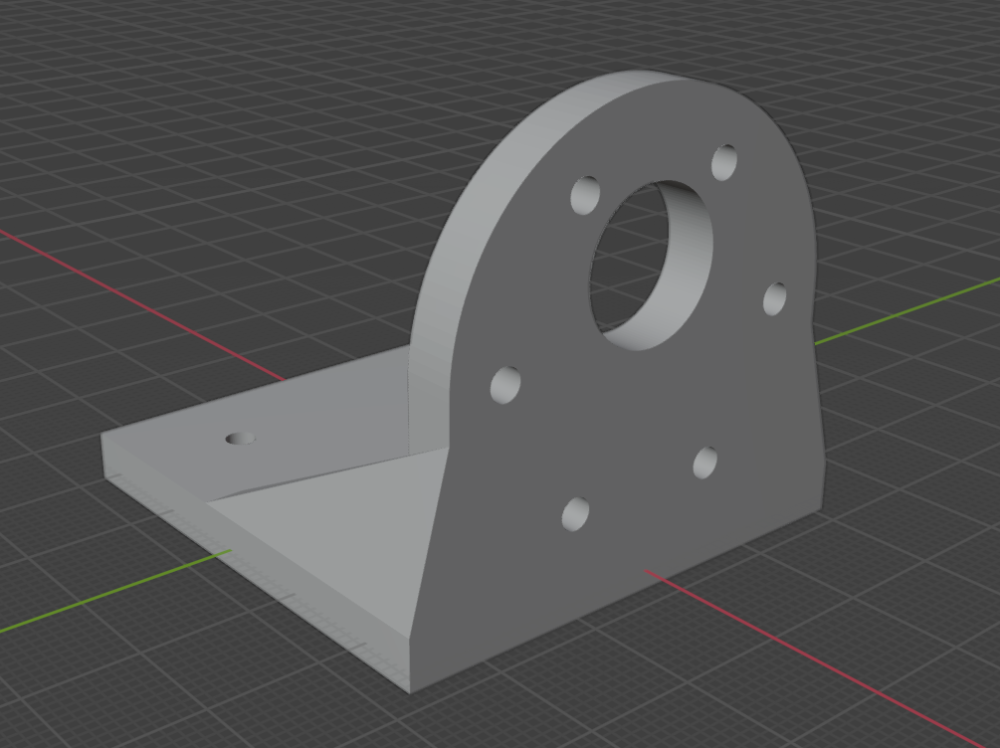
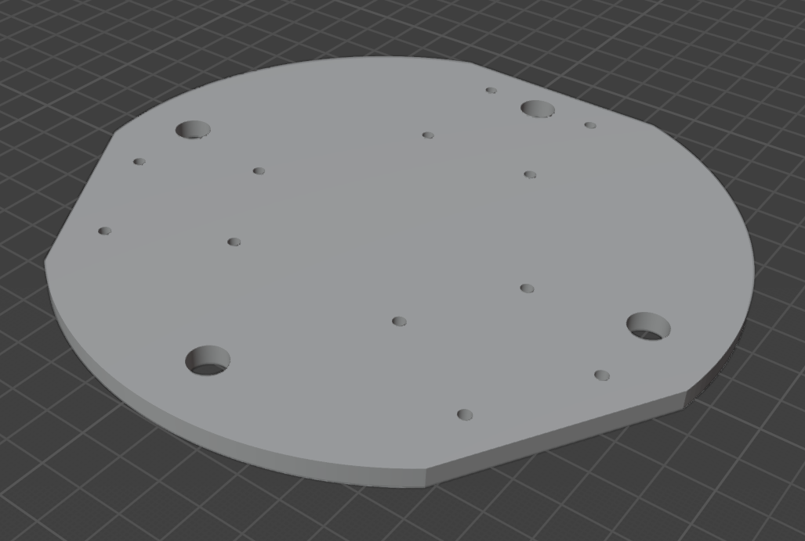
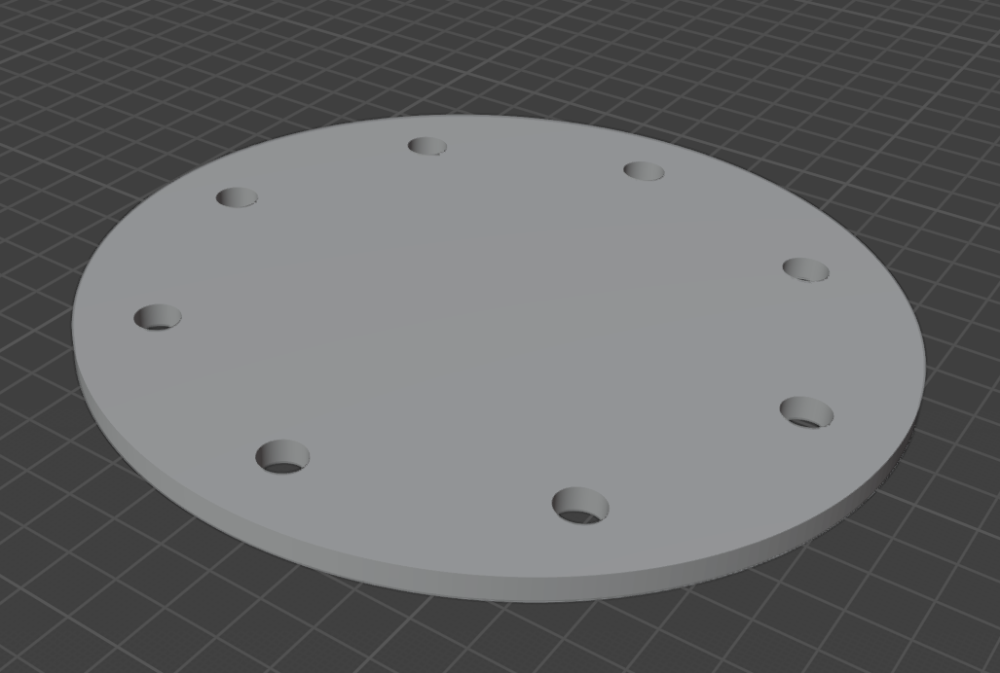
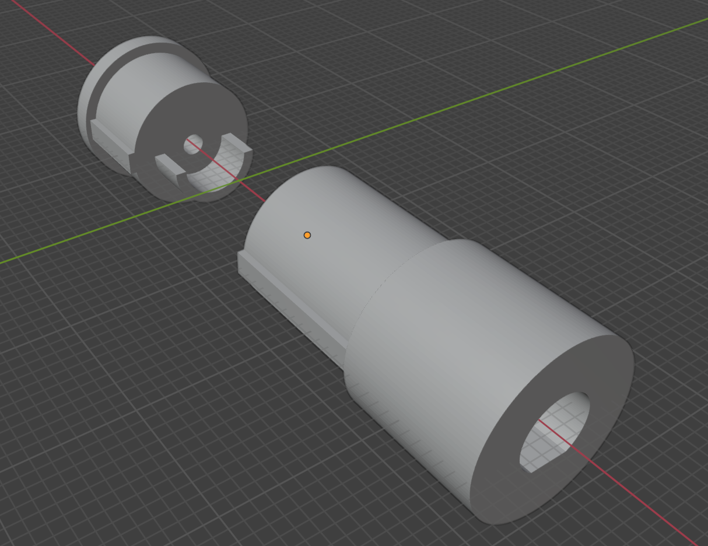

# Omni-wheeled modular platform
### Current model state:
- [x] Wheel brackets 

- [x] Lower floor 

- [x] Medium floor 

- [ ] Upper floor 
      
_image will be later..._
- [ ] Side mount 
      
_image will be later..._
- [x] Wheel hub 

- [ ] Lidar mount 
      
_image will be later..._
- [ ] Camera mount 
      
_image will be later..._

- [x] Pillars 

### 3D printed:
- [x] Wheel brackets **3/3**

_image will be later..._
- [x] Lower floor **1/1**

_image will be later..._
- [ ] Pillars **0/8**
      
_image will be later..._
- [ ] Medium floor **0/1**
      
_image will be later..._
- [ ] Upper floor **0/1**
      
_image will be later..._
- [ ] Side mount **0/4**
      
_image will be later..._
- [ ] Wheel hub **0/3**

_image will be later..._
- [ ] Lidar mount **0/1**
      
_image will be later..._
- [ ] Camera mount **0/1**
      
_image will be later..._

### Code:
- [ ] Motor control class
- [ ] Kinematics
- [x] Lidars ros2-package
